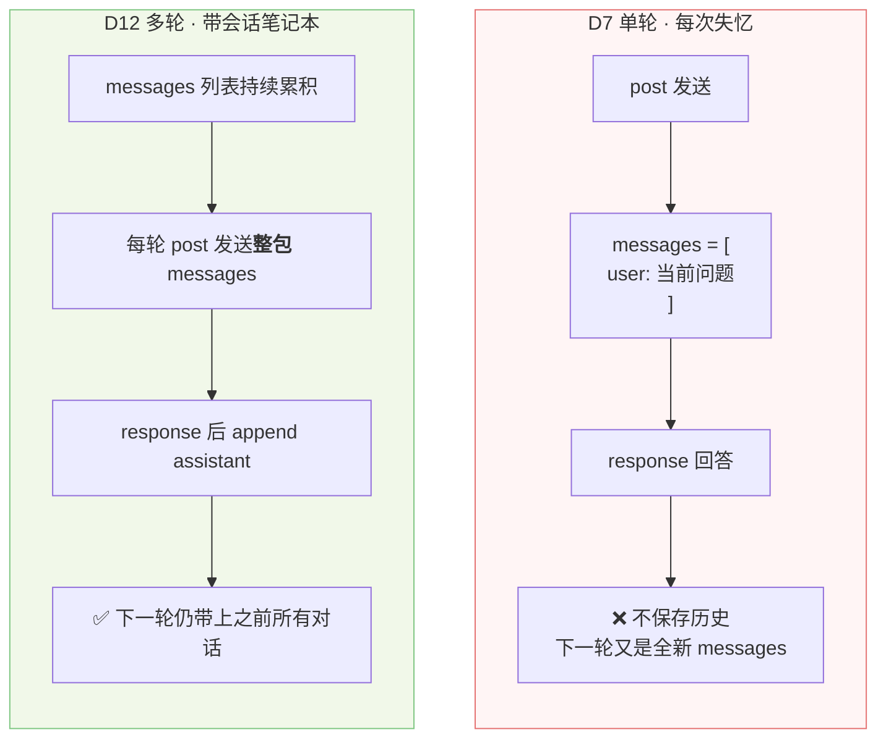
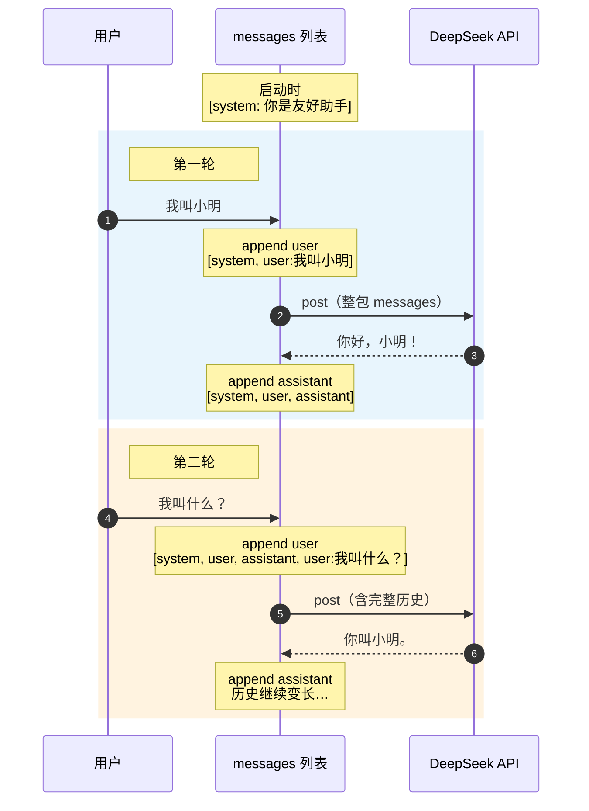
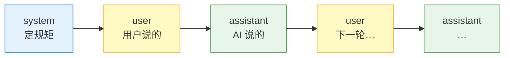
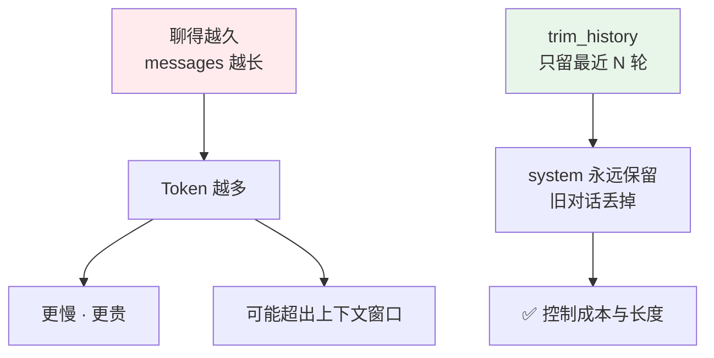

# Day 12 · messages 多轮对话流程图

> 学完 Day 12 后，将下方 Mermaid 图复制到 `学习笔记.md` 对应章节即可。  
> VS Code / GitHub / 多数 Markdown 预览支持 Mermaid 渲染。

---

## 总览：D7 单轮 vs D12 多轮



---

## 多轮对话详细流程（两轮示例）



---

## messages 列表变化（表格版）

### 第一轮：「我叫小明」

| 步骤 | 操作 | messages 内容 |
|------|------|----------------|
| 0 | 程序启动 | `[system]` |
| 1 | `append` user | `[system, user: 我叫小明]` |
| 2 | **post → API** | ↑ 发送这一包 |
| 3 | 收到回答 | assistant: `你好，小明！` |
| 4 | `append` assistant | `[system, user, assistant]` |

### 第二轮：「我叫什么？」

| 步骤 | 操作 | messages 内容 |
|------|------|----------------|
| 5 | `append` user | `[system, user, assistant, user: 我叫什么？]` |
| 6 | **post → API** | ↑ 模型能看到第一轮 → 能答「小明」 |
| 7 | 收到回答 | assistant: `你叫小明。` |
| 8 | `append` assistant | 历史继续累积… |

---

## 核心代码对应

```python
# 会话笔记本（程序启动时创建，整个聊天期间一直存在）
messages = [
    {"role": "system", "content": "你是友好的助手。"},
]

# 每一轮循环里：
messages.append({"role": "user", "content": question})   # ① 用户话入本
answer = ask_ai(messages)                                 # ② 整本 post 给 API
messages.append({"role": "assistant", "content": answer}) # ③ AI 话也入本
```

---

## 三个 role



---

## 为什么要 trim_history？（Day 12 ② 预习）



---

## 粘贴到笔记时可用的一句话

> **多轮对话**：用 `messages` 列表累积 `user` / `assistant` 交替记录；每轮把**整包**发给 API，模型并无记忆，是靠历史消息才「记得」上文。
