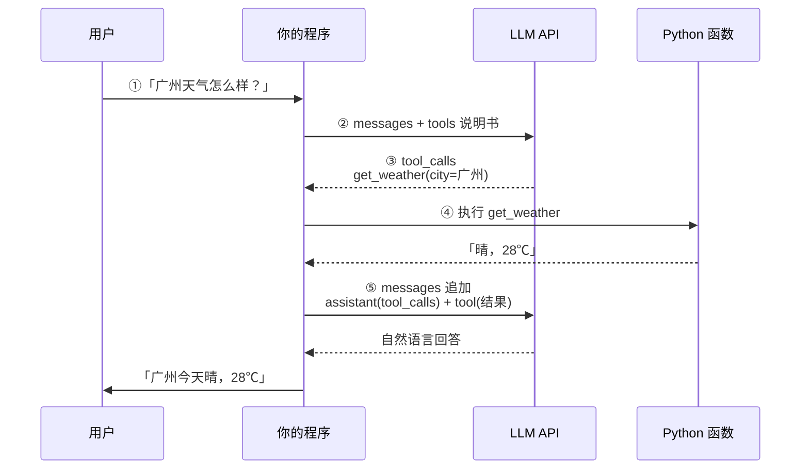
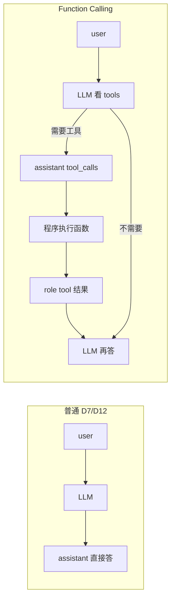

# Day 14 · Function Calling 流程图

> 先**自己手绘**再对照本页。D14 验收：能讲清每一步「谁在干活」。

---

## 总览（五步）



---

## 和「普通聊天」对比



---

## messages 增长示意

```
第 1 次请求：
  [ system?, user: 广州天气怎么样？ ]  + tools=[...]

第 1 次响应：
  assistant: tool_calls=[get_weather({city:广州})]

第 2 次请求：
  [ ...上面历史...,
    assistant(tool_calls),
    tool: "晴，28℃" ]

第 2 次响应：
  assistant: "广州今天晴，气温 28℃。"  ← 给用户看的
```

---

## 记忆口诀

**说明书给模型 → 模型点菜（tool_calls）→ 厨房是你（执行）→ 上菜回模型 → 模型对人说话**
