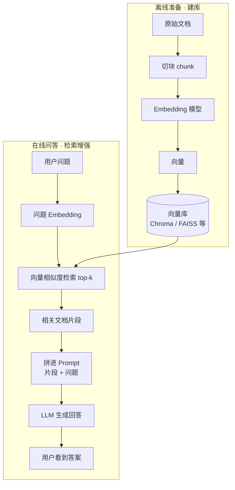

# Day 16 · RAG 流程图

> 建议：先自己在纸上画五步，再对照本图。

## 对照记忆

| 步 | 发生什么 | 谁在干活 |
|----|----------|----------|
| 1 | 文档切块 | 你的程序 / 平台 |
| 2 | 块 → 向量并入库 | Embedding 模型 + 向量库 |
| 3 | 问题 → 向量 | Embedding 模型 |
| 4 | 找最像的几块 | 向量库（相似度） |
| 5 | 片段 + 问题 → 回答 | LLM |

**和 Function Calling 的对比（帮助串联）：**

- FC：模型缺**能力**（算数、查时间）→ 调工具
- RAG：模型缺**知识**（你的文档）→ 先检索再答
