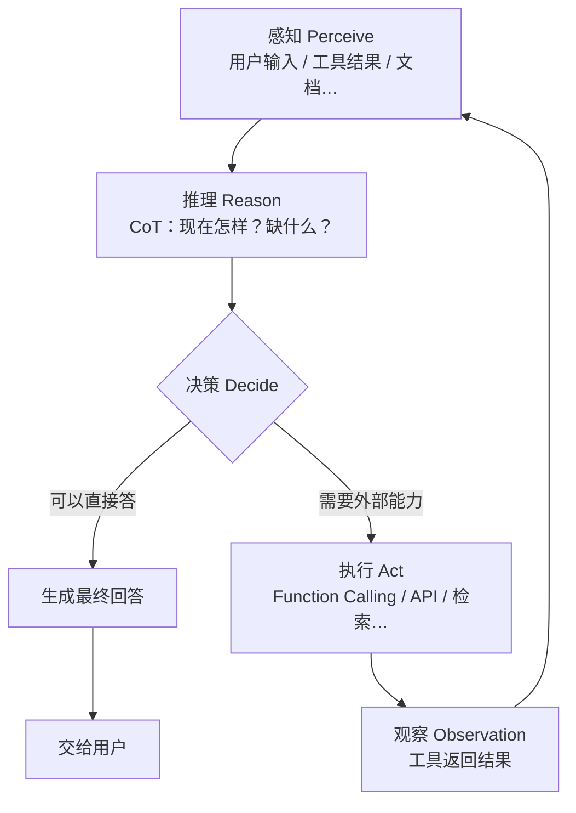

# Day 18 · Agent 循环图

> 建议：先自己在纸上画「感知 → 推理 → 决策 → 执行 → 再感知」，再对照。

## 和你已学内容的挂钩

| 步骤 | 你学过的 |
|------|----------|
| 感知 | messages 里的 user；`role:tool` 结果；RAG 检索片段 |
| 推理 | CoT、System Prompt |
| 决策 | 模型选「直接 stop」还是 `tool_calls` |
| 执行 | 你的 Python `run_tool`；将来天气 API 等 |

**一句话**：Chatbot 常常只走到「推理→回答」；Agent 会在「决策→执行→再感知」上多转几圈。
