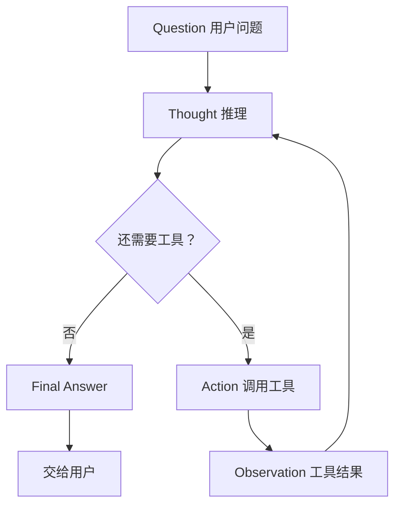

# Day 19 · ReAct 循环图

> 建议：先手写自己的 Thought/Action/Observation 例子，再对照本图。



## 和 D18 Agent 四步对齐

```text
感知  ←── Observation（以及最初的 Question）
推理  ←── Thought
决策  ←── 决定 Action 还是 Final Answer
执行  ←── Action（程序真正跑工具）
```

## 迷你示例（天气，仅示意）

```text
Question: 北京今天适合户外运动吗？

Thought 1: 需要先知道北京天气。
Action 1: get_weather[北京]
Observation 1: 晴，15℃，风力 3 级

Thought 2: 温度偏低但无雨，可以说适合轻度户外，提醒添衣。
Final Answer: 今天北京晴、约 15℃，适合轻度户外运动，建议加件外套。
```

注意：上面只有 **1 轮** Action；你的作业要求尽量写到 **≥2 轮**（例如先查天气，再根据降水概率决定要不要查穿衣建议，或先算再解释）。
