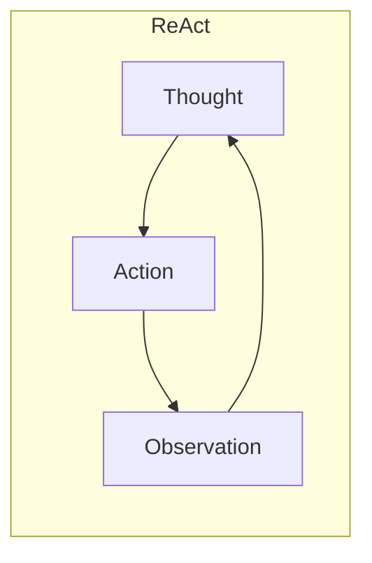
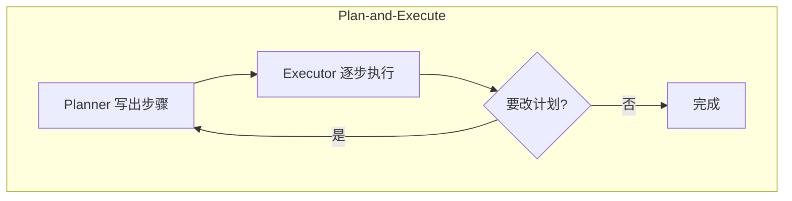
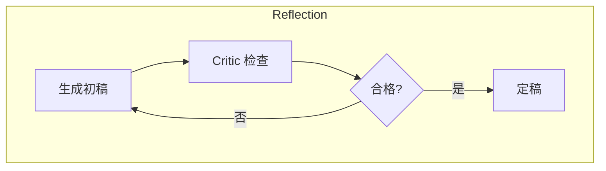

# Day 24 · 三种 Agent 架构对照

```mermaid
flowchart LR
  subgraph ReAct
    R1[Thought] --> R2[Action]
    R2 --> R3[Observation]
    R3 --> R1
  end
```

```mermaid
flowchart TD
  subgraph PE[Plan-and-Execute]
    P[Planner 写出步骤] --> E[Executor 逐步执行]
    E --> C{要改计划?}
    C -->|是| P
    C -->|否| Done1[完成]
  end
```

```mermaid
flowchart TD
  subgraph Ref[Reflection]
    G[生成初稿] --> K[Critic 检查]
    K --> M{合格?}
    M -->|否| G
    M -->|是| Done2[定稿]
  end
```
